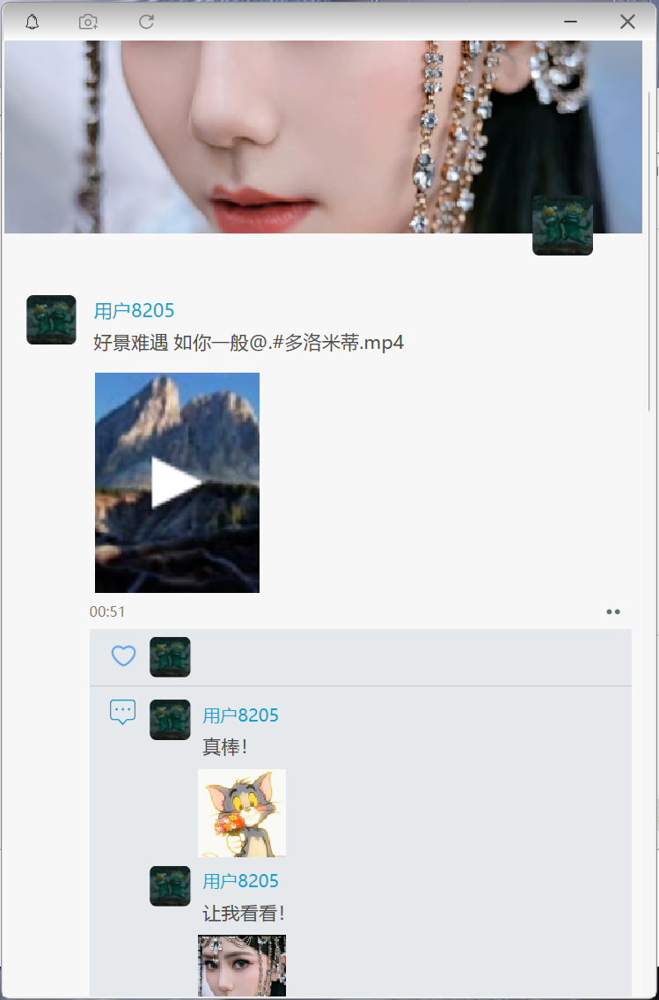
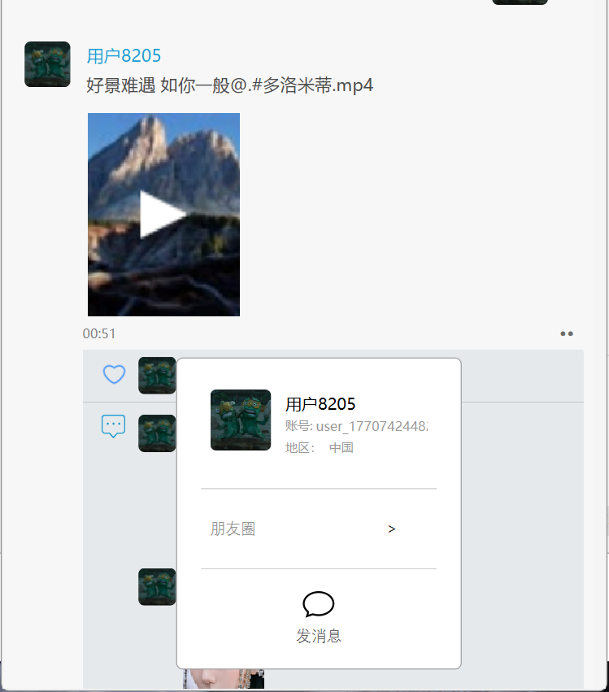
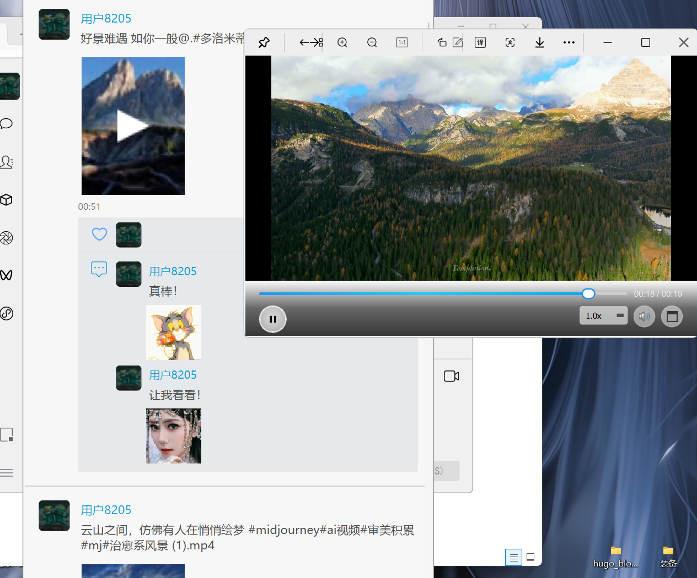
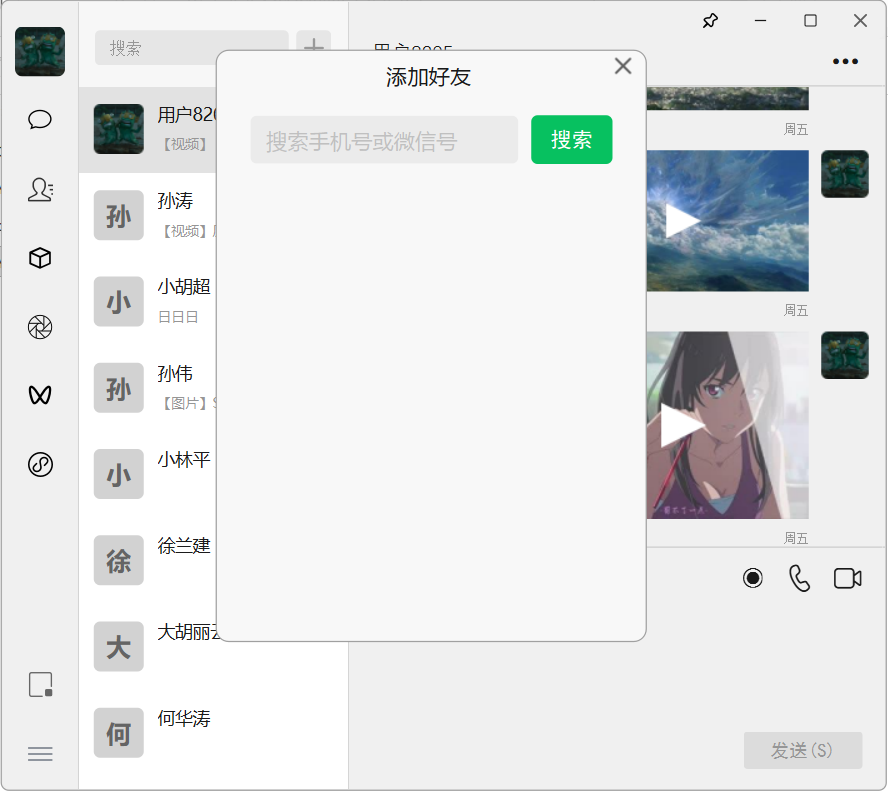
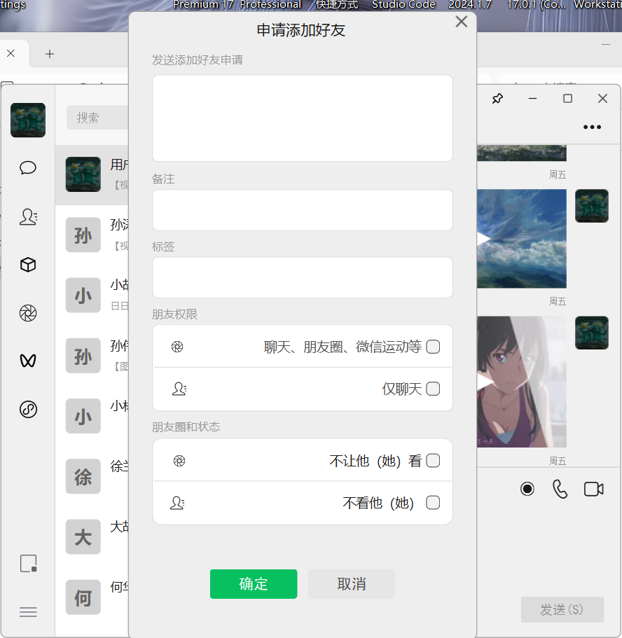

# 模仿微信的聊天软件
QT开发客户端，（目前还没做后端）。具备方式文本信息、图片信息、视频信息、文件信息、语音信息等功能。本地持久化使用SQLite。
### 客户端架构
```
[UI模块] <-------------------------> [控制模块]
                                          |
          +------------------------------+-----------------------------+
          |                              |                             |
[网络模块（WebSocket）]        [存储模块（SQLite）]             [媒体处理模块]
          |                              |                             |
[与服务端通信]                        [本地消息缓存]           [生成视频或图片等缩略图..]
```


## 测试截图
### 截图1


### 截图2


| 截图3 | 截图4 |
|-------|-------|
|  |  |

### 截图5


### 截图6


### 截图7


### 截图8


### 截图9



## 二、演示视频

<a href="https://www.bilibili.com/video/BV1hLUWBgEmW/?share_source=copy_web&vd_source=7c6fa4d409af9007042bf28e483b4dac" target="_blank" rel="noopener noreferrer">
  打开视频
</a>

